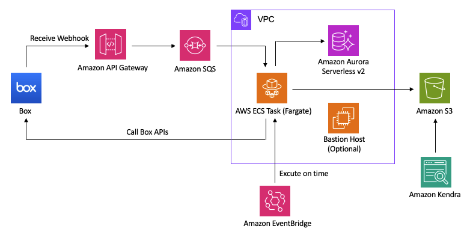

# kendra-box-connector

このソリューションは Box 内のドキュメントを Amazon Kendra で検索するサンプルアプリです。  
Webhook を使用することで既存の Kendra の Box コネクタよりも Box API の使用量を少なくします。

デプロイや使用の方法については `./docs` 内のドキュメントをお読みください。

現在の実装では、Webhook の署名の検証 を行なっていません。
署名の検証を行うとセキュリティが向上するため、要件に応じて実装してください。
